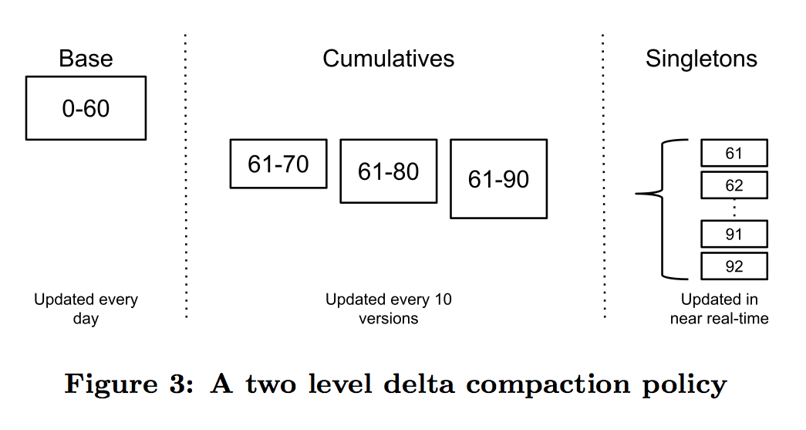
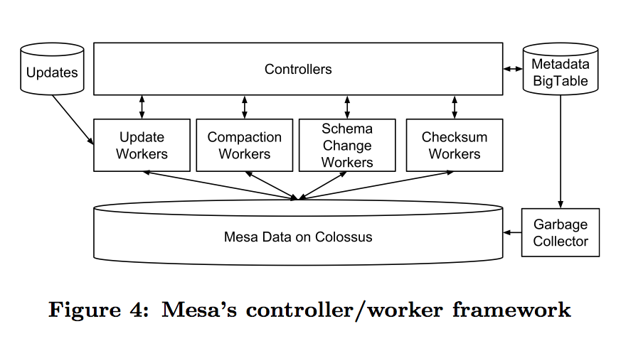
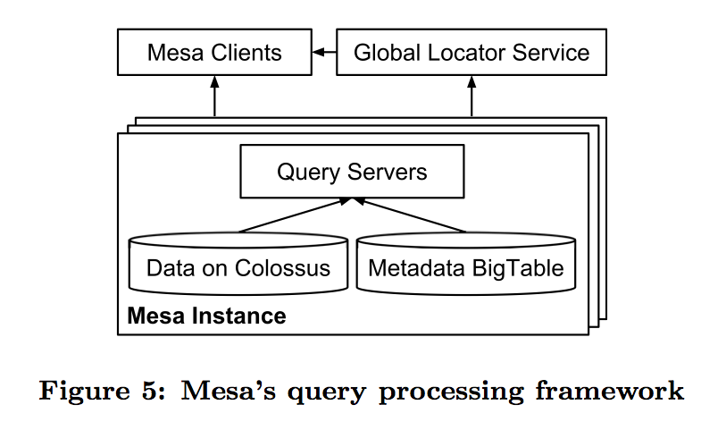
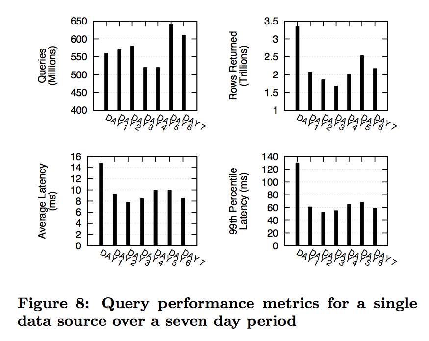
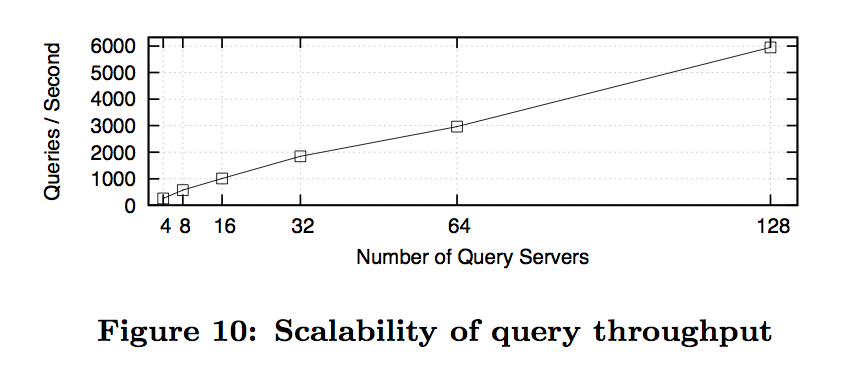
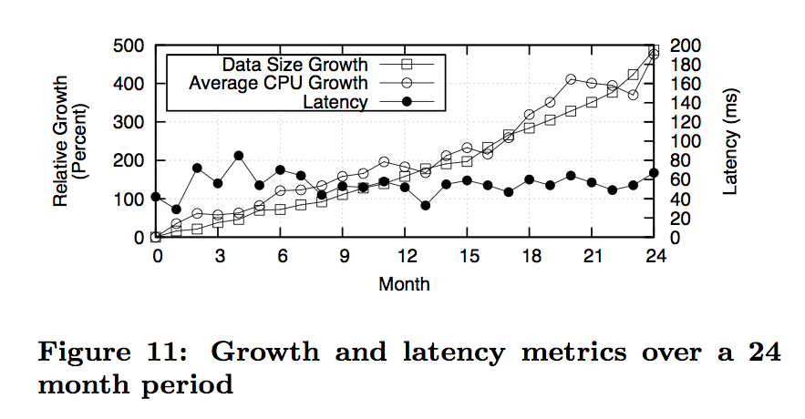

# Mesa: 全球备份, 近乎实时, 可拓展数据仓库

> 翻译自 [Mesa: Geo-Replicated, Near Real-Time, Scalable Data Warehousing](http://static.googleusercontent.com/media/research.google.com/en//pubs/archive/42851.pdf)

Ashish Gupta, Fan Yang, Jason Govig, Adam Kirsch, Kelvin Chan, Kevin Lai, Shuo Wu, Sandeep Govind Dhoot, Abhilash Rajesh Kumar, Ankur Agiwal, Sanjay Bhansali, Mingsheng Hong, Jamie Cameron, Masood Siddiqi, David Jones, Jeff Shute, Andrey Gubarev, Shivakumar Venkataraman, Divyakant Agrawal

Google, Inc.



## 概述

Mesa是一个高度可拓展的分析数据仓库，它存储了与Google互联网广告业务相关的关键数据。Mesa是设计用于满足用户和系统复杂和具有挑战性的需求集，其中包括近乎实时的数据输入和查询，同时要实现大数据和查询集的高可用、可靠性、错误容忍性和可拓展性。特别的是，Mesa能处理PT级的数据，每秒完成数百万行数据的更新，每天服务几十亿次查询和万亿次数据读取操作。Mesa能够夸多个数据中心备份，并且在低延时提供一致的和可重复的请求响应，即使一整个数据中心垮了也没问题。这篇论文介绍了Mesa系统并报告了它所实现的性能和可拓展性。

## 1. 介绍

Google在多个地域运行着一个可拓展的广告平台，它每天为全球的用户提供数十亿广告服务。与每个广告相关的详细信息，例如目标的标准、给人留下印象和点击的数量等等，都会实时记录并处理。这些数据广泛地用在Google不同的用例上，包括报告、内部审计，分析，计费和预测。广告要在推广效果上获得良好的效果，必须通过与复杂的前端服务交互来解决对底层数据的在线和按需查询。Google的内部广告服务平台使用实时数据来确定预算和之前已经上线的广告性能，用以提高现在和未来广告服务的相关性。作为Google广告平台就需要继续拓展，而作为内部和外部用户则要求对他们广告行为更大的可视化，对更多细节和细粒度信息的需求导致了原始数据大小的急速增长。可拓展性和数据的重要性导致了针对处理、存储和查询的技术和可操作性的独特挑战。对这种数据存储的需求如下：

**原子性更新。**一个单独的用户行为可能导致对相关数据的多次更新，影响着数千个一致性的视图，这些视图由一些指标集组成（如点击和花费）而且跨越一系列维度（例如广告商和国家）。它绝不可能在部分更新完成时就查询到系统的某个状态。

**一致性和正确性。**由于商业和法律的原因，这个系统必须返回一直而且正确的数据。我们要求强一致性并且是可重复的，即使这个请求跨越了多个数据中心。
 
**可用性。**这个系统必须没有单点故障。在预计和没有预计到的维护和失败下也没有停机时间，这包括整个数据中心或者整个地域停运的影响。

**近乎实时的更新吞吐量。**这个系统必须支持持续的更新，不管是新的行数据还是对现有行的增量更新，在一秒内数百万行数据的顺序上实现更新。这个更新操作在几分钟内对跨越不同视图和数据中心的一致性请求都必须是有效的。

**查询性能。**这个系统必须支持对延时敏感的用户，为有低延时需求的用户和要求高吞吐的批处理用户服务。总而言之，这个系统必须支持单点查询在99%的情况下延时低于几百毫秒，并且总体的查询吞吐量一天要达到数万亿行。

**可拓展性。**这个系统必须能够随着数据量和请求数的增长而拓展。例如，它必须能够支持万亿行和PT级的数据。更新和查询的效率必须在这些数据增长得很大时维持住。

**在线数据和元数据转换。**为了支持新的特性和对现有数据粒度的改变，客户端通常要求改变数据Schema或者修改现有数据的值。这些改变必须不会影响到普通的查询和更新操作。

Mesa是Google对于这些技术性和可操作性难题的解决方案。即使这些需求的子集已经被现有的数据仓库解决了，Mesa是唯一同时为商业关键数据解决所有这些难题的。

Mesa是一个分布式、可备份并且高可用的结构化数据处理、存储和查询系统。Mesa处理由上层服务生成的数据，聚合然后持久化这些数据到内部，并且通过用户的查询提供数据的服务。即使这篇论文大部分都在讨论将Mesa应用在广告系统中，Mesa其实是一个通用的数据仓库解决方案，用以满足上述的所有需求。

Mesa综合了Google的基础架构和服务，例如Colossus（Google的下一代分布式文件系统）[22, 23]、BigTable[12]和MapReduce[19]。为了实现存储的可拓展性和可用性，数据进行水平分区和复制。更新操作将应用在单个表或者多个表的粒度上。为了实现在更新时一致而且可重复的查询，底层存储的数据都是有多个版本的。为了实现可拓展的更新，数据更新都是批量处理、同时分配一个新的版本号和周期性（例如每几分钟）合并到Mesa中。为了实现在多个数据中心之间更新的一致性，Mesa使用基于Paxos[35]的分布式同步协议。

大部分基于关系型技术和数据魔方[25]的商业数据仓库都不支持每隔几分钟连续的数据集成和聚合，同时不能对用户的查询提供几乎实时的响应。通常，这些解决方案与传统的企业氛围相关，他们不太频繁地将数据聚合到数据仓库，例如一天或者一周一次。相似的，没有Google处理大数据内部技术可以应用于此，例如BigTable[12]、Megastore[11]、Spanner[18]和F1[41]。BigTable不支持Mesa应用的原子性需求。同时Megastore、Spanner和F1（这三个都是针对在线的事务处理）能够在全球同步的数据中提供强一致性，但他们不支持Mesa客户端要求峰值更新吞吐量。然而，Mesa借鉴了基于Spanner的BigTable和Paxos技术用于存储和管理元信息。

最近的研究结果也要求数据分析和数据存储要能够动态拓展。Wong[49]已经开发了一个系统可以在云中提供大批量并行分析服务。然而，这个系统是设计与多租户的环境，它有大量用户和相对较小的数据痕迹。Xin[51]已经实现了Shark利用分布式共享内存来支持拓展数据分析。然而Shark只专注于内存中的处理和分析性查询。Athanassoulis[10]已经提出了MaSM（物化排序合并）算法，它可用于结合闪存存储设备来支持数据仓库的在线更新。

这篇论文的关键贡献在于：

* 我们展示了我们如何创建一个PT级数据仓库系统，它支持需要事务处理的ACID语义，并且能够拓展到好大的吞吐量来处理Google的广告指标。

* 我们介绍了一个版本管理系统，它通过批处理更新来实现更新操作的低延时和高吞吐量，查询操作也达到同样低延时高吞吐量的性能。

* 我们描述了一个高度可拓展的分布式架构，它在一个数据中心对于机器和网络失败可以弹性容忍。我们同样展示了解决数据仓库错误的全球同步架构。与我们的设计有所区别的是应用数据是通过在独立而且冗余的多个数据中心异步备份，然而只有关键的元数据是通过复制状态同步到所有副本。这种技术最小化了在多个数据中心管理副本的开销，同时提供了非常高的更新吞吐量。

* 我们展示了如果动态而有效地改变大量表的Schema，同时不影响已存在应用的正确性和性能。

* 我们描述了用于承受软硬件故障导致的问题和数据损坏的关键技术。

* 我们 描绘了维护一个可拓展系统的一些可操作性挑战，在正确性、一致性、性能强和新研究能做贡献的领域来提高最先进的技术。

论文其他部分的组织如下。第二部分描述Mesa得存储子系统。第三部分展示Mesa系统的架构和它的跨数据中心部署。第四部分展示Mesa的一些高级功能和特性。第五部分报告Mesa开发的经验，而第六部分报告Mesa生成环境下部署的指标。第七部分回顾了相关同坐，而第八部分总结这篇论文。

## 2. Mesa存储子系统

Mesa中的数据是持续生成的，它是Google最大而且最有价值的数据之一。对这些数据的分析查询有简单的查询，如“在特定一天某个特别广告商的广告有多少点击率？”，或者是更多查询的场景，如“在十月第一个的8点到11点显示在google.com针对美国地区使用移动设备的广告商有多少广告点击率？”在Mesa中数据本质是多维的，它包括在Google广告平台多维度的细微的数据。这些数据主要由两种属性组成：多维属性（我们成为键）和度量属性（我们成为值）。细微很多维度属性是分层的（并且甚至有多个层次等等，数据维度能以日/月/年或者财政的周/季/年来组织），一个单个数据局域这些维度层次可以聚合到多个物化视图中，它支持数据的向下聚合和向上聚合。一个稳定的数据仓库设计要求单个属性的存在是一致的，不管经过任何可能的方式进行物化和聚合。

### 2.1 数据模型

在Mesa中，数据是使用表来管理的。每个表有一个用于指定其结构的Schema。特别的是，一个表Schema指定了表的键空间K和相关的值空间V，而K和V都是集合。表的Schema也指定函数F : V x V-> V，它用户聚合相同键的所有值。这个集合函数一定要是相关的（例如对于所有值F且v0 , v1 , v2 ∈ V，（F(v0,v1),v2) = F(v0,F(v1,v2)）实际上，它通常也是交换的（例如F(v0,v1) = F(v1,v0)），尽管Mesa确实有不可交换集合函数的表（例如F(v0,v1) = v1来替换一个值）。这个Schema也用于指定表的一个或多个索引，这些索引都是在K中的全排序。

键空间K和值空间V代表着每个列的多个元组，每个元组有一个固定的类型（例如int32、int64、字符串等等）。Schema为每个独立的值列指定了一个相关的聚合函数，而F是隐式定义为智能聚合坐标的值列，例如：

F((x1,...,xk),(y1,...,yk)) = (f1(x1,y1),...,fk(xk,yk))，其中(x1,...,xk),(y1,...,yk) ∈ V是列值的任意两个元组，而且f1到fk是Schema为每个值列显示定义的。

举个例子，图1显示了三个Mesa表。这三个表都包含了广告点击和成本指标（值列），而且通过各种属性细分了，例如点击的数据、广告商、展示这个广告的网站和国家（键列）。这个用于所有值列的聚合函数就是SUM累加。所有指标在这三个表中是一致的，假设相同的底层事件在所有的这些表更新了数据。图1是Mesa表Schema的简化视图。在生产环境中，Mesa包含超过一千个表，大部分的表拥有数百个列，而且使用各种聚合函数。

### 2.2 更新和查询

为了实现很高的更新吞吐量，Mesa批量地调用更新。这些更新的批量包是在Mesa外部的上游应用产生的，典型的是按几分钟的频率产生（更小更频繁的批量包能实现更低的更新延时，但消耗更多的资源）。通常，对Mesa的一个更新操作指定一个版本号n（从0开始按顺序分配），和一个表单包含的行集合（表名、键和值）。每个更新操作对每个列包含最多一个聚合值。

对Mesa的一个查询操作包含一个版本号n和在键空间的一个谓词P。而响应包含对于每个匹配P的键的一行，它出现在版本在0到n的更新中。响应中一个键的值是聚合了在那些更新中的所有值。Mesa实际上支持比这个更复杂的请求功能，但这些全部都能看做是这个原语的前置操作和后置操作。

举个例子，图2显示了两个针对图1定义的表的更新操作，当聚合在表A、B和C。为了维护表的一致性（在2.1部分讨论到），每个更新操作包含两个表A和B的一致行行。Mesa自动对表B处理这些更新操作，因为它们能直接从表B的更新中衍生出来。理论上，单个更新操作包括广告ID和出版商ID属性能够用于更新三个表，但那样的操作太重了，尤其是在更通用的例子中各个表都有很多属性（例如是一个交叉的产品）。

注意表C响应了一个物化的视图，对于表B进行以下的查询操作：SELECT SUM(Clicks), SUM(Cost) GROUP BY AdvertiserId, Country。这个查询可以直接表示为一个Mesa表，因为在查询中使用SUM函数匹配了使用SUM作为聚合函数处理表B的值列。Mesa限制了物化视图来使用相同的聚合函数，处理父表的指标列。

为了实现更新的原子性，Mesa使用一个多版本的方法。Mesa按版本顺序来执行更新操作，确保在移至下一个更新操作前原子性地合并更新操作。更新操作的严格顺序在原子性以外还有更多的应用。实际上，在Mesa的Schema上的聚合函数可能不能交换，例如在标准的键值存储中一个键值的更新会完全覆盖这个键以前的所有值。更巧妙的事，这种有序的约束允许Mesa支持不同的实例，包括不准确的因素可能是相反的行为。特备的是，Google使用在线的伪删除来确定一个点击是否有效。伪点击是有负面因素的偏移。举个例子，可能在有一个版本2的更新更随在图2的更新以后，它包括负面点击和成本，相应地标记之前的广告点击为不合法的。通过确保更新的严格顺序，Mesa保证了负面的因素在正面处理之前从不被注册。

### 2.3 版本化数据的管理

版本化数据在Mesa的更新和查询中都是非常重要的一环。然而，它也面临着多种挑战。第一，根据广告数据的聚合本质，独立地存储每个版本从存储的角度是非常浪费的。聚合的数据在传统中能够做得更小。第二，在查询的时候访问各个版本并且聚合它们是很重的而且增加了访问延时。第三，原生的在每次更新时对所有版本的预聚合可能变成非常的重。

为了处理这些挑战，Mesa预聚合某些版本化数据然后存储它，数据存储时包含一个行集合（没有重复的键）和特定版本（或者更简单的一个版本），这是通过[V1,V2]来表示的，V1和V2是更新的版本号，而且V1 ≤ V2。我们更倾向于某个版本当它的含义是清晰的。在[V1,V2]中的行对应了键的集合，这些键出现在更新操作而且它们的版本号在V1和V2之间（包括前后）。每个键的值是它们更新中值的聚合。更新操作在Mesa中会合并成单体（或者更简单的单体）。对于单体这个版本[V1 , V2]对应了一个版本号n的更新，而且通过设V1 = V2 = n。

一个版本[V1, V2]和另一个版本[V2 + 1, V3]能够聚合到版本[V1, V3]，通过简单地合并行键和因而聚合值。（已经在2.4部分讨论过，行是通过键和其他两个版本能够在线性时间中合并。）这个计算的正确性跟随在相关的聚合函数F后。值得注意的是，正确性不依赖于F的可交换性，而Mesa对给定的键聚合两个值中，这个版本总是在表单[V1 , V2] and [V2 + 1, V3]中，而且聚合是执行在版本的递增顺序中。

Mesa允许用户在一个特定的版本中查询一个限制的时间段（例如24小时）。这就意味着在这个时间段前的版本可以聚合到新的基版本中（或者简单地成为基点）和版本[0, B]对于B ≥ 0的版本而言，并且这以后的所有版本[V1, V2]其中0 ≤ V1 ≤ V2 ≤ B都可以被删除。这个过程称为基点聚合，而且Mesa根据其他操作来同步和异步地执行它（例如合并更新和响应查询）。

记住这是为了合并的目的，与更新版本相关的时间是那个版本产生的，而且是独立于数据中可能存在的任何时间序列信息。例如，在图1中的Mesa表，与2014/01/01关联的数据从没有被删除。然而Mesa在一段时候后可能拒绝查询特定的版本。数据中的日期是对Mesa不透明的另一个属性。

有了基准合并，为了响应版本号为n的查询，我们能够聚合基准增量[0, B]，而所有单个增量为[B + 1, B + 1]、[B + 2, B + 2]到[n, n]，然后返回请求的行。即使我们频繁地（例如每天）运行基准拓展（译者注base expansion），所有单体（译者注singletons）的数量仍然很容易就到几百（或者甚至几千），尤其是更新密集的表时。为了支持更有效的查询操作，Mesa在表单[U, V]中维护了一系列累计的增量D，其中在称为累计合并的过程中B < U < V。这些增量能够用于找到增量{[0, B]、[B+1, V1]、[V1 +1, V2]到[Vk +1, n]}对于某个版本n的跨越集（译者注spanning set），它要求比简单使用单体更少的聚合。当然，关于累计增量有存储和处理的开销，但这开销是均摊到所有操作中（尤其是查询），这允许使用它们的增量而不是单体。

增量合并策略决定了当时由Mesa维护的增量集。它的主要目的是均衡一次查询所必须做的处理，对更新带来的延时可以加入到Mesa的增量中，与生成和维护增量相关的处理和存储开销也是。更具体的是，增量策略决定了：（1）什么增量（不包括单体）必须在允许更新版本来查询（在更新路径中同步，查询更快的同时减缓更新）之前产生。（2）什么增量应该在更新路径外异步地生成。（3）什么时候能够删除增量。

增量合并策略的一个例子是在图3显示的两层策略。


An example of delta compaction policy is the two level policy illustrated in Figure 3. Under this example policy, at any point in time there is a base delta [0, B], cumulative deltas with versions [B + 1,B + 10],[B + 1,B + 20],[B + 1, B + 30], . . ., and singleton deltas for every version greater than B. Generation of the cumulative [B+1, B+10x] begins asynchronously as soon as a singleton with version B+10x is incorporated. A new base delta [0,B′] is computed approx- imately every day, but the new base cannot be used until the corresponding cumulative deltas relative to B′ are gen-

erated as well. When the base version B changes to B′, the policy deletes the old base, old cumulative deltas, and any singletons with versions less than or equal to B′. A query then involves the base, one cumulative, and a few singletons, reducing the amount of work done at query time.
Mesa currently uses a variation of the two level delta pol- icy in production that uses multiple levels of cumulative deltas. For recent versions, the cumulative deltas compact a small number of singletons, and for older versions the cu- mulative deltas compact a larger number of versions. For example, a delta hierarchy may maintain the base, then a delta with the next 100 versions, then a delta with the next 10 versions after that, followed by singletons. Re- lated approaches for storage management are also used in other append-only log-structured storage systems such as LevelDB [2] and BigTable. We note that Mesa’s data main- tenance based on differential updates is a simplified adapta- tion of differential storage schemes [40] that are also used for incremental view maintenance [7, 39, 53] and for updating columnar read-stores [28, 44].


### 2.4 物理数据和索引格式

Mesa deltas are created and deleted based on the delta compaction policy. Once a delta is created, it is immutable, and therefore there is no need for its physical format to efficiently support incremental modification.


The immutability of Mesa deltas allows them to use a fairly simple physical format. The primary requirements are only that the format must be space efficient, as storage is a major cost for Mesa, and that it must support fast seeking to a specific key, because a query often involves seeking into several deltas and aggregating the results across keys. To enable efficient seeking using keys, each Mesa table has one or more table indexes. Each table index has its own copy of the data that is sorted according to the index’s order.


The details of the format itself are somewhat technical, so we focus only on the most important aspects. The rows in a delta are stored in sorted order in data files of bounded size (to optimize for filesystem file size constraints). The rows themselves are organized into row blocks, each of which is individually transposed and compressed. The transposition lays out the data by column instead of by row to allow for better compression. Since storage is a major cost for Mesa and decompression performance on read/query significantly outweighs the compression performance on write, we em- phasize the compression ratio and read/decompression times over the cost of write/compression times when choosing the compression algorithm.


Mesa also stores an index file corresponding to each data file. (Recall that each data file is specific to a higher-level table index.) An index entry contains the short key for the row block, which is a fixed size prefix of the first key in the row block, and the offset of the compressed row block in the data file. A na ̈ıve algorithm for querying a specific key is to perform a binary search on the index file to find the range of row blocks that may contain a short key matching the query key, followed by a binary search on the compressed row blocks in the data files to find the desired key.


## 3. Mesa系统架构

Mesa是使用Google通用的基础架构和服务构建的，包括BigTable[12]和Colossus[22,23]。Mesa运行在多个数据中心里，每个数据中心运行一个Mesa实体。我们从描述实体的设计来开始。然后我们会讨论这些实体是怎样集成构建一个完整的跨数据中心Mesa部署系统。


### 3.1 一个数据中心实体

每个Mesa实体是由两个子系统组合而成：跟新管理和查询系统。这些子系统是解耦的，允许他们独自拓展。所有持久化的元数据都存储在Bigtable而所有的数据文件都存在Colossus。对于运行的正确性，这两个子系统之间不需要直接的通信。



#### 3.1.1 Update/Maintenance Subsystem

The update and maintenance subsystem performs all nec- essary operations to ensure the data in the local Mesa in- stance is correct, up to date, and optimized for querying. It runs various background operations such as loading updates, performing table compaction, applying schema changes, and running table checksums. These operations are managed and performed by a collection of components known as the controller/worker framework, illustrated in Figure 4.
The controller determines the work that needs to be done and manages all table metadata, which it persists in the metadata BigTable. The table metadata consists of detailed state and operational metadata for each table, including en- tries for all delta files and update versions associated with the table, the delta compaction policy assigned to the table, and accounting entries for current and previously applied operations broken down by the operation type.
The controller can be viewed as a large scale table meta- data cache, work scheduler, and work queue manager. The controller does not perform any actual table data manipu- lation work; it only schedules work and updates the meta- data. At startup, the controller loads table metadata from a BigTable, which includes entries for all tables assigned to the local Mesa instance. For every known table, it sub- scribes to a metadata feed to listen for table updates. This subscription is dynamically updated as tables are added and dropped from the instance. New update metadata received on this feed is validated and recorded. The controller is the exclusive writer of the table metadata in the BigTable.
The controller maintains separate internal queues for dif- ferent types of data manipulation work (e.g., incorporat- ing updates, delta compaction, schema changes, and table checksums). For operations specific to a single Mesa in- stance, such as incorporating updates and delta compaction, the controller determines what work to queue. Work that requires globally coordinated application or global synchro- nization, such as schema changes and table checksums, are initiated by other components that run outside the context of a single Mesa instance. For these tasks, the controller accepts work requests by RPC and inserts these tasks into the corresponding internal work queues.
Worker components are responsible for performing the data manipulation work within each Mesa instance. Mesa has a separate set of worker pools for each task type, al- lowing each worker pool to scale independently. Mesa uses an in-house worker pool scheduler that scales the number of workers based on the percentage of idle workers available.
Each idle worker periodically polls the controller to re- quest work for the type of task associated with its worker type until valid work is found. Upon receiving valid work, the worker validates the request, processes the retrieved

work, and notifies the controller when the task is completed. Each task has an associated maximum ownership time and a periodic lease renewal interval to ensure that a slow or dead worker does not hold on to the task forever. The controller is free to reassign the task if either of the above conditions could not be met; this is safe because the controller will only accept the task result from the worker to which it is assigned. This ensures that Mesa is resilient to worker fail- ures. A garbage collector runs continuously to delete files left behind due to worker crashes.
Since the controller/worker framework is only used for up- date and maintenance work, these components can restart without impacting external users. Also, the controller itself is sharded by table, allowing the framework to scale. In ad- dition, the controller is stateless – all state information is maintained consistently in the BigTable. This ensures that Mesa is resilient to controller failures, since a new controller can reconstruct the state prior to the failure from the meta- data in the BigTable.


#### 3.1.2 Query Subsystem
Mesa’s query subsystem consists of query servers, illus- trated in Figure 5. These servers receive user queries, look up table metadata, determine the set of files storing the required data, perform on-the-fly aggregation of this data, and convert the data from the Mesa internal format to the client protocol format before sending the data back to the client. Mesa’s query servers provide a limited query engine with basic support for server-side conditional filtering and “group by” aggregation. Higher-level database engines such as MySQL [3], F1 [41], and Dremel [37] use these primitives to provide richer SQL functionality such as join queries.
Mesa clients have vastly different requirements and per- formance characteristics. In some use cases, Mesa receives queries directly from interactive reporting front-ends, which have very strict low latency requirements. These queries are usually small but must be fulfilled almost immediately. Mesa also receives queries from large extraction-type work- loads, such as offline daily reports, that send millions of requests and fetch billions of rows per day. These queries require high throughput and are typically not latency sensi- tive (a few seconds/minutes of latency is acceptable). Mesa ensures that these latency and throughput requirements are met by requiring workloads to be labeled appropriately and then using those labels in isolation and prioritization mech- anisms in the query servers.
The query servers for a single Mesa instance are orga- nized into multiple sets, each of which is collectively capa- ble of serving all tables known to the controller. By using multiple sets of query servers, it is easier to perform query

server updates (e.g., binary releases) without unduly im- pacting clients, who can automatically failover to another set in the same (or even a different) Mesa instance. Within a set, each query server is in principle capable of handling a query for any table. However, for performance reasons, Mesa prefers to direct queries over similar data (e.g., all queries over the same table) to a subset of the query servers. This technique allows Mesa to provide strong latency guarantees by allowing for effective query server in-memory pre-fetching and caching of data stored in Colossus, while also allowing for excellent overall throughput by balancing load across the query servers. On startup, each query server registers the list of tables it actively caches with a global locator service, which is then used by clients to discover query servers.

### 3.2 Multi-Datacenter Deployment
Mesa is deployed in multiple geographical regions in order to provide high availability. Each instance is independent and stores a separate copy of the data. In this section, we discuss the global aspects of Mesa’s architecture.


#### 3.2.1 Consistent Update Mechanism
All tables in Mesa are multi-versioned, allowing Mesa to continue to serve consistent data from previous states while new updates are being processed. An upstream system gen- erates the update data in batches for incorporation by Mesa, typically once every few minutes. As illustrated in Fig- ure 6, Mesa’s committer is responsible for coordinating up- dates across all Mesa instances worldwide, one version at a time. The committer assigns each update batch a new ver- sion number and publishes all metadata associated with the update (e.g., the locations of the files containing the update data) to the versions database, a globally replicated and con- sistent data store build on top of the Paxos [35] consensus

algorithm. The committer itself is stateless, with instances running in multiple datacenters to ensure high availability.
Mesa’s controllers listen to the changes to the versions database to detect the availability of new updates, assign the corresponding work to update workers, and report successful incorporation of the update back to the versions database. The committer continuously evaluates if commit criteria are met (specifically, whether the update has been incorporated by a sufficient number of Mesa instances across multiple ge- ographical regions). The committer enforces the commit criteria across all tables in the update. This property is es- sential for maintaining consistency of related tables (e.g., a Mesa table that is a materialized view over another Mesa table). When the commit criteria are met, the committer declares the update’s version number to be the new commit- ted version, storing that value in the versions database. New queries are always issued against the committed version.
Mesa’s update mechanism design has interesting perfor- mance implications. First, since all new queries are issued against the committed version and updates are applied in batches, Mesa does not require any locking between queries and updates. Second, all update data is incorporated asyn- chronously by the various Mesa instances, with only meta- data passing through the synchronously replicated Paxos- based versions database. Together, these two properties al- low Mesa to simultaneously achieve very high query and update throughputs.

#### 3.2.2 New Mesa Instances
As Google builds new datacenters and retires older ones, we need to bring up new Mesa instances. To bootstrap a new Mesa instance, we use a peer-to-peer load mechanism. Mesa has a special load worker (similar to other workers in the controller/worker framework) that copies a table from another Mesa instance to the current one. Mesa then uses the update workers to catch up to the latest committed ver- sion for the table before making it available to queries. Dur- ing bootstrapping, we do this to load all tables into a new Mesa instance. Mesa also uses the same peer-to-peer load mechanism to recover from table corruptions.


## 4. ENHANCEMENTS
In this section, we describe some of the advanced features of Mesa’s design: performance optimizations during query processing, parallelized worker operations, online schema changes, and ensuring data integrity.
### 4.1 Query Server Performance Optimizations
Mesa’s query servers perform delta pruning, where the query server examines metadata that describes the key range that each delta contains. If the filter in the query falls out- side that range, the delta can be pruned entirely. This op- timization is especially effective for queries on time series data that specify recent times because these queries can fre- quently prune the base delta completely (in the common case where the date columns in the row keys at least roughly correspond to the time those row keys were last updated). Similarly, queries specifying older times on time series data can usually prune cumulative deltas and singletons, and be answered entirely from the base.
A query that does not specify a filter on the first key column would typically require a scan of the entire table. However, for certain queries where there is a filter on other

key columns, we can still take advantage of the index using the scan-to-seek optimization. For example, for a table with indexkeycolumnsAandB,afilterB=2doesnotforma prefix and requires scanning every row in the table. Scan-to- seek translation is based on the observation that the values for key columns before B (in this case only A) form a prefix and thus allow a seek to the next possibly matching row. For example, suppose the first value for A in the table is 1. During scan-to-seek translation, the query server uses the index to look up all rows with the key prefix (A = 1,B = 2). ThisskipsallrowsforwhichA=1andB<2. Ifthenext value for A is 4, then the query server can skip to (A = 4,B = 2), and so on. This optimization can significantly speed up queries, depending on the cardinality of the key columns to the left of B.
Another interesting aspect of Mesa’s query servers is the notion of a resume key. Mesa typically returns data to the clients in a streaming fashion, one block at a time. With each block, Mesa attaches a resume key. If a query server becomes unresponsive, an affected Mesa client can trans- parently switch to another query server, resuming the query from the resume key instead of re-executing the entire query. Note that the query can resume at any Mesa instance. This is greatly beneficial for reliability and availability, especially in the cloud environment where individual machines can go offline at any time.
### 4.2 Parallelizing Worker Operation
Mesa’s controller/worker framework consists of a controller that coordinates a number of different types of Mesa work- ers, each of which is specialized to handle a specific operation that involves reading and/or writing Mesa data for a single Mesa table.
Sequential processing of terabytes of highly compressed Mesa table data can routinely take over a day to complete for any particular operation. This creates significant scala- bility bottleneck in Mesa as table sizes in Mesa continue to grow. To achieve better scalability, Mesa typically uses the MapReduce framework [19] for parallelizing the execution of different types of workers. One of the challenges here is to partition the work across multiple mappers and reducers in the MapReduce operation.
To enable this parallelization, when writing any delta, a Mesa worker samples every s-th row key, where s is a pa- rameter that we describe later. These row key samples are stored alongside the delta. To parallelize reading of a delta version across multiple mappers, the MapReduce launcher first determines a spanning set of deltas that can be aggre- gated to give the desired version, then reads and merges the row key samples for the deltas in the spanning set to determine a balanced partitioning of those input rows over multiple mappers. The number of partitions is chosen to bound the total amount of input for any mapper.
The main challenge is to define s so that the number of samples that the MapReduce launcher must read is rea- sonable (to reduce load imbalance among the mappers), while simultaneously guaranteeing that no mapper partition is larger than some fixed threshold (to ensure parallelism). Suppose we have m deltas in the spanning set for a particu- lar version, with a total of n rows, and we want p partitions. Ideally, each partition should be of size n/p. We define each row key sample as having weight s. Then we merge all the samples from the deltas in the spanning set, choosing a row

key sample to be a partition boundary whenever the sum of the weights of the samples for the current partition exceeds n/p. The crucial observation here is that the number of row keys in a particular delta that are not properly accounted for in the current cumulative weight is at most s (or 0 if the current row key sample was taken from this particular delta). The total error is bounded by (m − 1)s. Hence, the maximum number of input rows per partition is at most n/p + (m − 1)s. Since most delta versions can be spanned with a small value of m (to support fast queries), we can typically afford to set a large value for s and compensate for the partition imbalance by increasing the total number of partitions. Since s is large and determines the sampling ratio (i.e., one out of every s rows), the total number of samples read by the MapReduce launcher is small.
### 4.3 Schema Changes in Mesa
Mesa users frequently need to modify schemas associated with Mesa tables (e.g., to support new features or to improve query performance). Some common forms of schema change include adding or dropping columns (both key and value), adding or removing indexes, and adding or removing entire tables (particularly creating roll-up tables, such as creating a materialized view of monthly time series data from a pre- viously existing table with daily granularity). Hundreds of Mesa tables go through schema changes every month.
Since Mesa data freshness and availability are critical to Google’s business, all schema changes must be online: nei- ther queries nor updates may block while a schema change is in progress. Mesa uses two main techniques to perform online schema changes: a simple but expensive method that covers all cases, and an optimized method that covers many important common cases.
The na ̈ıve method Mesa uses to perform online schema changes is to (i) make a separate copy of the table with data stored in the new schema version at a fixed update version, (ii) replay any updates to the table generated in the meantime until the new schema version is current, and (iii) switch the schema version used for new queries to the new schema version as an atomic controller BigTable metadata operation. Older queries may continue to run against the old schema version for some amount of time before the old schema version is dropped to reclaim space.
This method is reliable but expensive, particularly for schema changes involving many tables. For example, sup- pose that a user wants to add a new value column to a family of related tables. The na ̈ıve schema change method requires doubling the disk space and update/compaction processing resources for the duration of the schema change.
Instead, Mesa performs a linked schema change to han- dle this case by treating the old and new schema versions as one for update/compaction. Specifically, Mesa makes the schema change visible to new queries immediately, handles conversion to the new schema version at query time on the fly (using a default value for the new column), and similarly writes all new deltas for the table in the new schema ver- sion. Thus, a linked schema change saves 50% of the disk space and update/compaction resources when compared to the na ̈ıve method, at the cost of some small additional com- putation in the query path until the next base compaction. Linked schema change is not applicable in certain cases, for example when a schema change reorders the key columns in an existing table, necessitating a re-sorting of the existing

data. Despite such limitations, linked schema change is ef- fective at conserving resources (and speeding up the schema change process) for many common types of schema changes.
### 4.4 Mitigating Data Corruption Problems
Mesa uses tens of thousands of machines in the cloud that are administered independently and are shared among many services at Google to host and process data. For any compu- tation, there is a non-negligible probability that faulty hard- ware or software will cause incorrect data to be generated and/or stored. Simple file level checksums are not sufficient to defend against such events because the corruption can occur transiently in CPU or RAM. At Mesa’s scale, these seemingly rare events are common. Guarding against such corruptions is an important goal in Mesa’s overall design.
Although Mesa deploys multiple instances globally, each instance manages delta versions independently. At the log- ical level all instances store the same data, but the spe- cific delta versions (and therefore files) are different. Mesa leverages this diversity to guard against faulty machines and human errors through a combination of online and offline data verification processes, each of which exhibits a differ- ent trade-off between accuracy and cost. Online checks are done at every update and query operation. When writing deltas, Mesa performs row ordering, key range, and aggre- gate value checks. Since Mesa deltas store rows in sorted order, the libraries for writing Mesa deltas explicitly enforce this property; violations result in a retry of the correspond- ing controller/worker operation. When generating cumula- tive deltas, Mesa combines the key ranges and the aggre- gate values of the spanning deltas and checks whether they match the output delta. These checks discover rare corrup- tions in Mesa data that occur during computations and not in storage. They can also uncover bugs in computation im- plementation. Mesa’s sparse index and data files also store checksums for each row block, which Mesa verifies whenever a row block is read. The index files themselves also contain checksums for header and index data.
In addition to these per-instance verifications, Mesa pe- riodically performs global offline checks, the most compre- hensive of which is a global checksum for each index of a table across all instances. During this process, each Mesa instance computes a strong row-order-dependent checksum and a weak row-order-independent checksum for each index at a particular version, and a global component verifies that the table data is consistent across all indexes and instances (even though the underlying file level data may be repre- sented differently). Mesa generates alerts whenever there is a checksum mismatch.
As a lighter weight offline process, Mesa also runs a global aggregate value checker that computes the spanning set of the most recently committed version of every index of a table in every Mesa instance, reads the aggregate values of those deltas from metadata, and aggregates them appropriately to verify consistency across all indexes and instances. Since Mesa performs this operation entirely on metadata, it is much more efficient than the full global checksum.
When a table is corrupted, a Mesa instance can automat- ically reload an uncorrupted copy of the table from another instance, usually from a nearby datacenter. If all instances are corrupted, Mesa can restore an older version of the table from a backup and replay subsequent updates.

## 5. 经验和教训

在这个部分，我们快速地介绍我们在过去几年构建大规模数据仓库系统学到的关键经验。一个关键点就是当设计大规模可拓展基础架构时做好对未知意外的准备。而且在生产环境中，有很多低概率而且能导致重大故障的事件发生在我们的集群中。下面是我们按领域分组的经验教训，不过也不是面面俱到。

**分布式，并发和云计算。**Mesa能够管理高速率的数据增长，通过它在分布式和并发原理上的绝对可靠性。结合去中心化的架构的云计算原语已经被证实在数据和请求拓展时时很有用的。从特定的高性能专用服务器移到由通用计算机组成的新环境在整体的系统性能上有很多有趣的挑战。我们需要新的方法来解决这个环境下普通计算机有限的容忍性，而这些通常在专用高性能服务器运行得很好的技术在这个环境可能就不能工作了。举个例子，现在的数据分布在大约上千台服务器上，Mesa的查询服务器积极地从Colossus中预读数据，并且使用很多原语来减少从本地磁盘到Colossus迁移数据的性能下降。

 
**模块化，抽象和分层架构。**我们认为分层设计和架构是应对系统负责度最关键的，即使它可能要损失性能。在Google，例如Colossus和BigTable我们都从模块化和抽象底层架构受益，这允许我们专注于Mesa的架构组件。如果我们使用裸机从头开始建立Mesa将会大大提高我们工作的难度。


**容量计划。**从一开始，我们就对持续增长数据的做好计划和设计。当我们运行Mesa的前身时，它是直接构建在商业机器上的，我们发现我们应该能够更具项目数据的增长来预测我们的容量需求。然而，要有效地收购和部署特定的硬件是很有挑战性的。在Mesa中我们从Google基于云的标注基础架构转变到我们简单的容量计划。

**对应用层的假设。**当设计一个大规模基础架构时，给出关于应用的强保证必须非常小心。举个例子，当我们设计Mesa的前一个系统，我们就假设改变Schema是非常少的。这个假设最终发现是错的。因为一个公司，产品，服务和应用的产生的数据本质是一个持续的流。而且，新的应用程序可能有组织地加入也可能是被其他公司收购而继续支持。总而言之，我们的设计必须尽可能通过，对现在和未来的假设足够小。

**全球同步备份。**尽管我们在Mesa中支持大量数据的全球同步备份和系统可用性，我们也看到了每天操作这个概念的益处。在Mesa的前任系统中，有一个数据中心外围的计划好的停运，我们必须费力地将这24x7小时运行的系统迁移到另一个数据中心里。今天，这类计划好而且合理的停运已经对Mesa有很小的影响了。

**数据损坏和组件失败。**数据损坏和组件失败是Mesa系统拓展时一个重要的考虑点。数据损坏可能由于各种原因而发生，拥有必须的工具去预防和检测它们是很重要的。同样地，类似在机器上的浮点单元的错误组件是非常难诊断的。由于Mesa云主机是动态分配的本性，很难确保一个机器是不是一直处于服务状态。而且即使拥有错误单元的服务器被分配给了Mesa，使用它可能只会引起间歇性的问题。克服这些运维挑战仍然是一个未解决的问题。
**测试和增量部署。**Mesa是一个大型的、复杂的、关键的和持续优化的系统。同时管理新的特性和生产环境的正常是一个巨大的难题。幸运的是，我们发现通过组合一些标准的工程实践和Mesa总体的错误容忍架构和数据损坏的可靠性，我们能够以很小的风险持续地发布重大的提升。我们用到的一些技术是：单元测试、能够运行少量生产环境数据的私有开发者Mesa实体，和共享的测试环境，这个测试环境在上游运行大部分生产环境的数据。我们非常小心地对多个Mesa实体增量地部署新的特性。举个例子，当部署一个高风险的特性时，我们可能一次只部署到一个实体中。因为Mesa有指标来检测数据跨数据仓库的一致性（同样也有吞吐量监控和各组件的报警），我们发现我们能够很快地检测和解决问题。
 
**认为因素。**最后，我们面临着一个重要的挑战是，像Mesa这样的系统背后，都有一个很大的工程团队和继续加入的新员工。主要的挑战是怎样沟通来保证整个团队的认识都是最新的。我们目前依赖代码说明，单元测试，通用流程的文档，操作演练和对系统所有部分的交叉培训。目前为止，管理这些的复杂度和各种的责任持续地挑战我们个人和工程观点。

## 6. Mesa生产环境指标

在部分，我们会汇报在Mesa生产环境中更新和查询的性能指标。我们显示七天周期的指标来展示它的变化和稳定性。我们也显示系统在几年周期的指标增长，来展示这个系统是如果拓展来支持数据增长带来的资源线性增长的要求，同时要满足要求的请求性能。总而言之，Mesa是一个高度分散而且在多个数据中心同步备份并且在一个数据中心使用成百上千服务器处理更新和请求处理。尽管我们没有汇报我们部署的属性细节，我们提供的架构细节已经是综合并且能够传递高度分布式、大规模系统的本质。


### 6.1 更新操作



图7展示了Mesa在七天的周期中一个数据中心内的更新性能。Mesa支持数百个并发的更新数据源。对于这个特别的数据源，Mesa平均每秒读取30到60MB的压缩数据，更新300到600万独立的行和增加大约30万新的行数据。这个数据源大约每5分钟产生批量更新操作，而Mesa提交时间的平均值和95%百分比之下分别是54秒和211秒。Mesa会管理这些更新延时，避免更新操作由于动态拓展资源而积压下来。

### 6.2 请求操作



图8展示了Mesa在与前面相同数据源7天内的请求性能。Mesa每天处理这些表超过5亿的请求，放回1.7T到3.2T行。这些产品查询的本源差异非常大，从简单的单点查询到大规模遍历。我们汇报他们平均和99%一下的延时，这显示了Mesa能在几百毫秒内响应大部分的查询。而导致平均和最大延时的巨大差异的因素有很多，包括请求的类型，请求服务器缓存的内容，瞬间的故障和云平台基础架构各层次的重试，甚至是偶然遇到很慢的服务器。



图9展示了处理请求的开销和同样是7天内我们在4.1部分讨论过的遍历查询优化效果。返回的行大概只有30%到50%读是由于版本合并和请求指定的过滤。遍历查询优化避免了解压和读60%到70%的本来需要处理的版本化行。


在图10，我们报告了Mesa查询服务器的可拓展属性。Mesa的设计允许组件通过参数化资源来独立地拓展。在这个检验中，我们假设请求吞吐量的服务器从4增加到128.这个结果确定了Mesa请求处理能力的线性拓展。

### 6.3 增长

图11展示了Mesa在24个月的周期中数据和CPU使用率的增长，这也是我们最大的生产数据集之一。总的数据量增加了几乎有5倍，通过更新率（这增加了超过80%）和增加的新表、索引和物化视图。CPU使用有着相似的提高，但也受到一次性的运算例如改变Schema和我们过去部署时优化的影响。图11也包括了用一个监控工具测量很稳定的延时，它通过不断旁路请求服务器的缓存来定位综合的单点查询。事实上，在这个阶段Mesa响应用户单点查询的演示和图8显示在维护一个相似的返回大量行是一致的。

## 7. 相关工作

传统的关系型数据库管理系统广泛用于管理结构化数据，并且有强一致性保证。然而，它们在数据可拓展性和现代数据驱动型应用要求的性能有很多问题。键值存储系统（也被称为NoSQL系统）实现了使非关系型数据存储系统的高拓展性[1, 4, 12, 17, 20, 24]。键值存储系统通过牺牲事务性和强一致性保证来实现要求的可拓展性。Mesa则在设计上找到了新的一点来实现可拓展性、强一致性和事务性保证，通过限制系统只能用于批处理和控制的更新，而且这都是近乎实时的。

数据仓库[9, 14]提供了OLAP的支持进行大规模数据的挖掘和分析。那存在着这个领域的研究拓展体：视图选择的有效启发性[26, 27, 52]，视图维护[7, 15, 30, 39, 53]，数据魔方[25, 32, 42]，Schema变革[31]和数据仓库的索引[33, 38]和缓存[21, 29, 43]。这其中大部分的工作在于中央化的架构和可改变的存储。我们设想通过拓展他们用于云计算的大规模分布式架构以便在Mesa中采用这些技术，其中通用的规定的不可变存储使用基于日志的文件系统。其他工业调查小组在兼职存储中承担着视图管理[8]。

在商业中，对实时和可拓展性数据仓库的要求是不断增长的，它根据对业务关键数据的在线和实时分析不断提高的依赖性。在过去的几年里，对于传统的企业和提供互联网服务的公司都面临着数据爆炸式增长的情况。行业领导者如Teradata，SAP[5]， Oracle[48]和EMC/Greenplum[16]都通过均衡更多强大和并行的硬件和底层数据管理软件中使用复杂的并行技术来应对这个挑战。互联网服务公司如Twitter[36]，LinkedIn[50]，Facebook，[45, 46, 47]，Google [13, 37]和其他公司[6]通过组合新的技术：键值存储，列存储和MapReduce编程原语来应对这个挑战。然而，这些系统中很多都是设计支持批量载入接口来导入数据，这可能需要几个小时来运行。

从这个角度，Mesa非常像一个OLAP系统。Mesa的更新周期是几分钟，而且它能处理几亿行数据。Mesa使用多版本来支持跨表事务的更新和查询。一个类似Mesa的系统既支持动态更新也支持事务性数据的实时查询的是Vertica[34]。然而，据我们了解，这些商业的产品或生产系统没有一个是设计用于管理跨数据中心的备份数据。而且，我们也不清楚如果这些系统是否基于云或者能够弹性拓展的。它们可能只有有限的能力来动态处理导入数据的波动情况。
Google其他内部的数据解决方案[11, 12, 18, 41]都不能支持Google广告业务要求作为数据仓库的数据大小和更新效率。Mesa通过批处理更新搞作实现这个拓展性。每个更新操作会花费几分钟来提交并且每次批处理的元数据都会使用Paxos来提交以确保像Megastore、Spanner和F1所提供强一致性。因此Mesa在应用数据在多个数据仓库中是冗余的（而且独立的）也能保持唯一，同时元数据是使用同步备份来管理的。这种方法在数据损坏的情况下提供了额外的健壮性保证。


## 8. 总结

在这篇论文，我们展示了一个叫Mesa的系统从头到尾的设计和实现，它是全球同步备份、近乎实时并且可拓展的数据仓库。Mesa的工程设计权衡了在数据库和分布式系统的基础调研意见。特别的是，Mesa在提供强一致和事务正确性保证的同时支持在线的查询和更新。它通过使用基于批处理的接口，通过介绍瞬间的数据版本而消除在查询和更新事务基于锁的同步来实现这些原子性操作等特性。Mesa能跨数据中心实现全球同步备份来提高错误容忍性。最后，在每个数据中心里，Mesa的分层架构允许它分配工作并且根据计算的需求动态拓展，通过大量服务器来实现大规模拓展。

对持续产生的大量数据（不正式地说就是大数据）的实时分析是数据库和分布式系统的调研和实践中出现的重大挑战。一种解决方法是使用特定的硬件技术（例如拥有高速内连和大量内存的高并发机器）。另一种解决方案是通过基于类似MapReduce编程范例的基于批处理的分布式处理来处理均衡云资源。前者有助于数据实时分析但成本很高，而后者为了便宜的吞吐量牺牲了分析原始数据。


相反，Mesa是一个数据仓库，它是完全基于云（运行在动态的普通服务器上而且不依赖本地磁盘），它跨数据中心全球同步备份，并且提供强一致性和排序版本化的数据。Mesa也支持PT级别的数据和高负载的更新和查询。特别的是，Mesa支持几分钟延时内的大量更新，单点的低延时查询和高负载的批处理查询。


## 9. 致谢

我们感谢每一位曾经服务过Mesa团队的人，包括前期的团队成员Karthik Laksh- minarayanan，Sanjay Agarwal，Sivasankaran Chandrasekar，Justin Tolmer，Chip Turner和Michael Ballbach，他们为Mesa的设计和开发做了极大的贡献。我们也很感谢Sridhar Ramaswamy，他为Mesa团队提供了战略眼光和指引。最后，我们感谢所有评审员，他们的反馈极大地提高了这篇论文的质量。

## 10. 引用

[1] HBase.http://hbase.apache.org/.  
[2] LevelDB. http://en.wikipedia.org/wiki/LevelDB.  
[3] MySQL. http:www.mysql.com.  
[4] Pro ject Voldemart: A Distributed Database. http://www.project-voldemort.com/voldemort/.  
[5] SAP HANA. http://www.saphana.com/welcome.  
[6] A. Abouzeid, K. Bajda-Pawlikowski, et al. HadoopDB: An Architectural Hybrid of MapReduce and DBMS Technologies for Analytical Workloads. PVLDB, 2(1):922–933, 2009.  
[7] D. Agrawal, A. El Abbadi, et al. Efficient View Maintenance at Data Warehouses. In SIGMOD, pages 417–427, 1997.  
[8] P. Agrawal, A. Silberstein, et al. Asynchronous View Maintenance for VLSD Databases. In SIGMOD, pages 179–192, 2009.  
[9] M. O. Akinde, M. H. Bohlen, et al. Efficient OLAP Query Processing in Distributed Data Warehouses. Information Systems, 28(1-2):111–135, 2003.  
[10] M. Athanassoulis, S. Chen, et al. MaSM: Efficient Online Updates in Data Warehouses. In SIGMOD, pages 865–876, 2011.  
[11] J. Baker, C. Bond, et al. Megastore: Providing Scalable, Highly Available Storage for Interactive Services. In CIDR, pages 223–234, 2011.  
[12] F. Chang, J. Dean, et al. Bigtable: A Distributed Storage System for Structured Data. In OSDI, pages 205–218, 2006.  
[13] B. Chattopadhyay, L. Lin, et al. Tenzing A SQL Implementation on the MapReduce Framework. PVLDB, 4(12):1318–1327, 2011.  
[14] S. Chaudhuri and U. Dayal. An Overview of Data Warehousing and OLAP Technology. SIGMOD Rec., 26(1):65–74, 1997.  
[15] S. Chen, B. Liu, et al. Multiversion-Based View Maintenance Over Distributed Data Sources. ACM TODS, 29(4):675–709, 2004.  
[16] J. Cohen, J. Eshleman, et al. Online Expansion of Largescale Data Warehouses. PVLDB, 4(12):1249–1259, 2011.  
[17] B. F. Cooper, R. Ramakrishnan, et al. PNUTS: Yahoo!’s Hosted Data Serving Platform. PVLDB, 1(2):1277–1288, 2008.  
[18] J. C. Corbett, J. Dean, et al. Spanner: Google’s Globally-Distributed Database. In OSDI, pages 251–264, 2012.  
[19] J. Dean and S. Ghemawat. MapReduce: Simplified Data Processing on Large Clusters. Commun. ACM, 51(1):107–113, 2008.  
[20] G. DeCandia, D. Hastorun, et al. Dynamo: Amazon’s Highly Available Key-value Store. In SOSP, pages 205–220, 2007.  
[21] P. Deshpande, K. Ramasamy, et al. Caching Multidimensional Queries Using Chunks. In SIGMOD, pages 259–270, 1998.  
[22] A. Fikes. Storage Architecture and Challenges. http://goo.gl/pF6kmz, 2010.  
[23] S. Ghemawat, H. Gobioff, et al. The Google File System. In SOSP, pages 29–43, 2003.  
[24] L. Glendenning, I. Beschastnikh, et al. Scalable Consistency in Scatter. In SOSP, pages 15–28, 2011.  
[25] J. Gray, A. Bosworth, et al. Data Cube: A Relational Aggregation Operator Generalizing Group-By, Cross-Tabs and Sub-Totals. In IEEE ICDE, pages 152–159, 1996.  
[26] H. Gupta and I. S. Mumick. Selection of Views to Materialize Under a Maintenance Cost Constraint. In ICDT, 1999.  
[27] V. Harinarayan, A. Rajaraman, et al. Implementing Data Cubes Efficiently. In SIGMOD, pages 205–216, 1996.  
[28] S. H ́eman, M. Zukowski, et al. Positional Update Handling in Column Stores. In SIGMOD, pages 543–554, 2010.  
[29] H. V. Jagadish, L. V. S. Lakshmanan, and D. Srivastava. Snakes and Sandwiches: Optimal Clustering Strategies for a Data Warehouse. In SIGMOD, pages 37–48, 1999.  
[30] H. V. Jagadish, I. S. Mumick, et al. View Maintenance Issues for the Chronicle Data Model. In PODS, pages 113–124, 1995.  
[31] A. Koeller and E. A. Rundensteiner. Incremental Maintenance of Schema-Restructuring Views in SchemaSQL. IEEE TKDE, 16(9):1096–1111, 2004.  
[32] L. V. S. Lakshmanan, J. Pei, et al. Quotient cube: How to Summarize the Semantics of a Data Cube. In VLDB, pages 778–789, 2002.  
[33] L. V. S. Lakshmanan, J. Pei, et al. QC-Trees: An Efficient Summary Structure for Semantic OLAP. In SIGMOD, pages 64–75, 2003.  
[34] A. Lamb, M. Fuller, et al. The Vertica Analytic Database: C-Store 7 Years Later. PVLDB, 5(12):1790–1801, 2012.  
[35] L. Lamport. The Part-Time Parliament. ACM Trans. Comput. Syst., 16(2):133–169, 1998.  
[36] G. Lee, J. Lin, et al. The Unified Logging Infrastructure for Data Analytics at Twitter. PVLDB, 5(12):1771–1780, 2012.  
[37] S. Melnik, A. Gubarev, et al. Dremel: Interactive Analysis of Web-Scale Datasets. PVLDB, 3(1-2):330–339, 2010.  
[38] N. Roussopoulos, Y. Kotidis, et al. Cubetree: Organization of and Bulk Incremental Updates on the Data Cube. In SIGMOD, pages 89–99, 1997.  
[39] K. Salem, K. Beyer, et al. How To Roll a Join: Asynchronous Incremental View Maintenance. In SIGMOD, pages 129–140, 2000.  
[40] D. Severance and G. Lohman. Differential Files: Their Application to the Maintenance of Large Databases. ACM Trans. Database Syst., 1(3):256–267, 1976.  
[41] J. Shute, R. Vingralek, et al. F1: A Distributed SQL
Database That Scales. PVLDB, 6(11):1068–1079, 2013. [42] Y. Sismanis, A. Deligiannakis, et al. Dwarf: Shrinking the PetaCube. In SIGMOD, pages 464–475, 2002.  
[43] D. Srivastava, S. Dar, et al. Answering Queries with Aggregation Using Views. In VLDB, pages 318–329, 1996. [44] M. Stonebraker, D. J. Abadi, et al. C-Store: A Column-oriented DBMS. In VLDB, pages 553–564, 2005. [45] A. Thusoo, J. Sarma, et al. Hive: A Warehousing Solution Over a Map-Reduce Framework. PVLDB, 2(2):1626–1629, 2009.  
[46] A. Thusoo, J. Sarma, et al. Hive - A Petabyte Scale Data Warehouse Using Hadoop. In IEEE ICDE, pages 996–1005, 2010.  
[47] A. Thusoo, Z. Shao, et al. Data Warehousing and Analytics Infrastructure at Facebook. In SIGMOD, pages 1013–1020, 2010.  
[48] R. Weiss. A Technical Overview of the Oracle Exadata Database Machine and Exadata Storage Server. Oracle White Paper. Oracle Corporation, Redwood Shores, 2012.   
[49] P. Wong, Z. He, et al. Parallel Analytics as a Service. In SIGMOD, pages 25–36, 2013.  
[50] L. Wu, R. Sumbaly, et al. Avatara: OLAP for Web-Scale Analytics Products. PVLDB, 5(12):1874–1877, 2012.  
[51] R. S. Xin, J. Rosen, et al. Shark: SQL and Rich Analytics at Scale. In SIGMOD, pages 13–24, 2013.  
[52] J. Yang, K. Karlapalem, et al. Algorithms for Materialized View Design in Data Warehousing Environment. In VLDB, pages 136–145, 1997.  
[53] Y. Zhuge, H. Garcia-Molina, et al. The Strobe Algorithms for Multi-Source Warehouse Consistency. In PDIS, pages 146–157, 1996.
